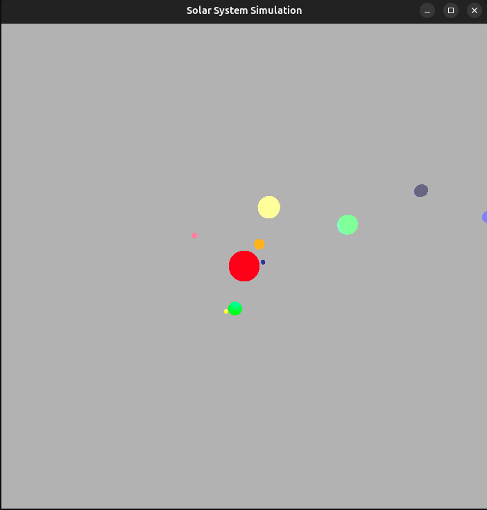
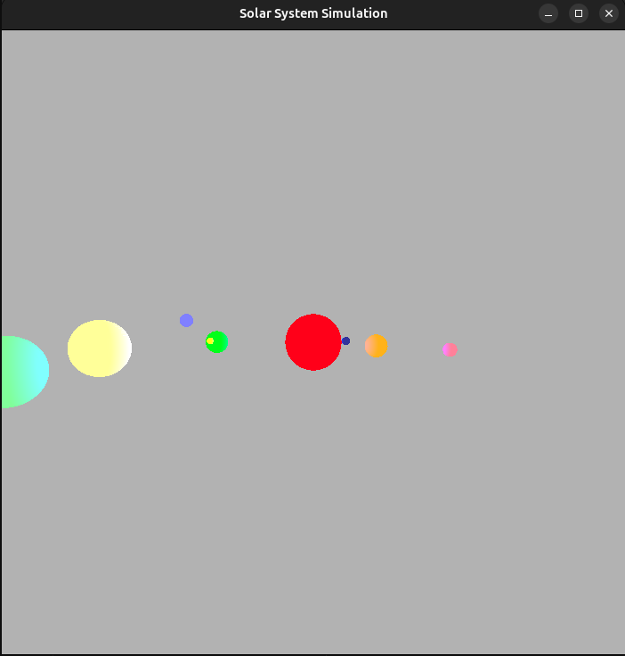

# Solar System Simulator 🌌

This simulator allows you to explore our solar system in 3D. You can interact with planets, zoom in and out, and observe their orbits in real-time. It's a fun and educational way to learn about the movements and characteristics of the planets and other celestial objects in our solar system.

### ✨ Features
- 🌍 3D View of the Solar System: View all the planets, moons, and the Sun from different angles.
- 🔄 Planet Orbits: Planets move in their orbits around the Sun in real-time.
- 🌑 Interactive Controls: Zoom in, rotate, and pan to explore the solar system from various perspectives.
- 🌠 OpenGL Rendering: Efficient, smooth, and high-performance rendering using OpenGL.

### 🔧 Installation
1. Clone the repository
```bash
git clone https://github.com/giovanni-iannaccone/solar-system
cd solar-system
```

2. Install dependencies
```bash
sudo apt-get install libglfw3 libglfw3-dev libglew-dev libglm-dev
```

3. Build and run the project
```
make && ./solarsystem
```

### Controls 🎮
- **W** - Move camera up (Y-axis)
- **S** - Move camera down (Y-axis)
- **A** - Move camera left (X-axis)
- **D** - Move camera right (X-axis)
- **Q** - Move camera forward (Z-axis)
- **E** - Move camera backward (Z-axis)
- **Shift + [W/S/A/D/Q/E]** - Move faster
- **R** - Reset camera to default position
- **Esc** - Exit the simulation

## 📸 Screenshots



Let’s explore the solar system! 🚀